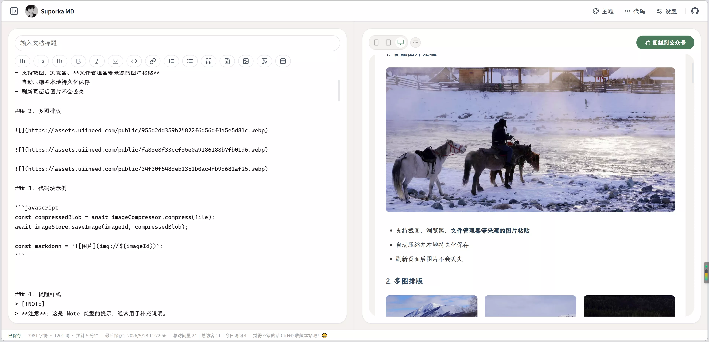
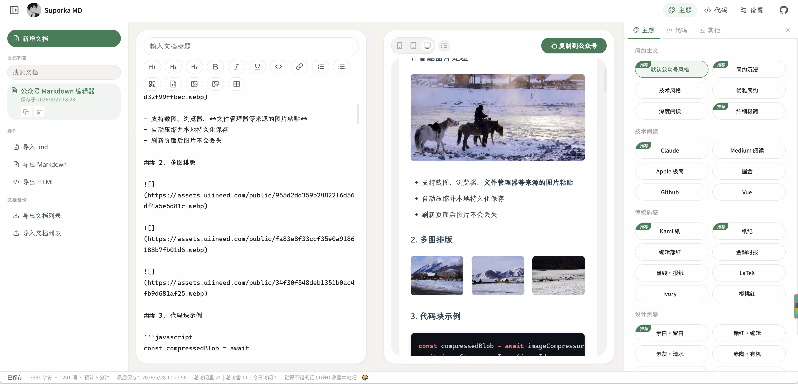

# Suporka MD - 公众号 Markdown 编辑器

一个面向微信公众号写作与排版的纯前端 Markdown 编辑器，支持实时预览、代码块主题、GitHub Alerts、Task List、图片本地持久化、TOC 目录与一键复制富文本。


## 在线地址

- [https://markdown.suporka.site](https://markdown.suporka.site)


## 仓库地址：

- https://github.com/zxpsuper/wechat-md/

## Screenshot






## 核心能力

### 1. 编辑与预览
- 左侧 Markdown 编辑，右侧实时预览。
- 支持常用编辑快捷操作（标题、加粗、斜体、引用、代码块、分割线、表格等）。
- 支持桌面/手机/平板预览模式切换。
- 支持 Task List 语法 `- [x]` / `- [ ]`，渲染为带复选框的列表项。
- 支持 GitHub Alerts 语法：`[!NOTE]`、`[!TIP]`、`[!IMPORTANT]`、`[!WARNING]`、`[!CAUTION]`。
- 支持目录（TOC）功能，自动提取 h1/h2/h3 锚点，方便长文导航。
- 支持字体缩放（0.75x ~ 1.5x，6 档），适配不同阅读偏好。

### 2. 文档管理
- 支持多文档创建、切换、复制、删除、搜索。
- 删除操作使用确认弹窗，避免误删。
- 删除最后一篇文档后会自动创建一篇空白文档，保证始终有可编辑文档。
- 文档与当前激活状态会持久化到 `localStorage`。

### 3. 自动保存与保存状态
- 输入后采用固定 `5 秒` 防抖自动保存。
- 状态栏显示 `保存中 / 已保存 / 保存失败` 与最后保存时间。
- 保留显式保存快捷键：`Ctrl/Cmd + S`。

### 4. 主题与代码面板
- 内置多套公众号排版主题（当前 27 套），按风格分类：
  - **简约主义**：默认公众号风格、简约沉浸、技术风格、优雅简约、深度阅读、纤细极简
  - **技术阅读**：Claude、掘金、GitHub、Vue、Medium 阅读、Apple 极简
  - **传统质感**：Kami 纸、纸纪、编辑部红、金融时报、墨线·报纸、LaTeX、Ivory、樱桃红
  - **设计灵感**：素白·留白、赭红·编辑、素灰·清水、赤陶·有机、墨蓝·卫报、朱红·日经、素墨·世界报
- 代码面板支持独立代码主题（当前 17 套，含跟随主题风格选项）。
- 代码块显示项可独立配置：显示代码语言、显示复制按钮、显示 macOS 装饰点。


### 5. 图片处理（本地优先）
- 支持粘贴、拖拽、工具栏上传图片。
- 使用 Canvas 压缩（保留 GIF/SVG 策略）后写入 IndexedDB。
- 编辑器内使用 `img://` 短链接，避免大段 Base64 影响输入性能。
- 渲染时从 IndexedDB 读取并替换为可预览 URL。
- 复制到公众号时自动转换为 Base64，提升粘贴兼容性。
- 支持图片显示自定义：上下边距、圆角（圆角/正圆）、阴影（颜色/偏移/模糊/透明度/扩散）。

### 6. 导出与复制
- 一键复制到公众号（富文本 HTML，含图片 Base64、代码高亮、公式转换）。
- 一键复制纯 Markdown。
- 支持导出 `.md` 与 `.html`（含图片 Base64 嵌入）。
- 支持导出/导入文档列表（JSON 格式），方便备份与迁移。

## 技术栈

- Vue 3（CDN）
- markdown-it
- highlight.js
- turndown
- IndexedDB
- Canvas API
- 原生 ES Modules + 纯 CSS

## 本地运行

```bash
# 进入项目目录
cd wechat-md

# 启动本地静态服务
python -m http.server 8080

# 访问
# http://localhost:8080
```

也可使用仓库内脚本：

```bash
./start.sh
```

## 项目结构（当前）

```text
wechat-md/
├── index.html              # 主应用页面
├── about.html              # 关于页面
├── README.md
├── LICENSE
├── start.sh                # 本地启动脚本
├── assets/
│   ├── images/
│   │   ├── favicon.ico
│   │   ├── icon.svg
│   │   ├── cover-index.webp
│   │   └── cover-setting.webp
│   ├── scripts/
│   │   ├── main.js                 # 应用入口
│   │   ├── core/
│   │   │   ├── alerts-plugin.js    # GitHub Alerts 插件
│   │   │   ├── image-compressor.js # Canvas 图片压缩
│   │   │   ├── image-store.js      # IndexedDB 图片存储
│   │   │   ├── markdown-engine.js  # Markdown 渲染引擎
│   │   │   ├── paste-handler.js    # 粘贴处理
│   │   │   ├── render-pipeline.js  # 渲染管线
│   │   │   └── task-lists-plugin.js# Task List 插件
│   │   ├── export/
│   │   │   ├── clipboard-exporter.js   # 公众号富文本复制
│   │   │   ├── file-exporter.js        # .md/.html 文件导出
│   │   │   ├── math-exporter.js        # 数学公式导出
│   │   │   └── x-clipboard-exporter.js # X(Twitter) 兼容复制
│   │   ├── storage/
│   │   │   └── preferences.js     # 用户偏好持久化
│   │   └── ui/
│   │       ├── code-themes.js     # 代码主题配置（17 套）
│   │       ├── panel-manager.js   # 面板状态管理
│   │       ├── theme-manager.js   # 主题管理/分类/收藏
│   │       └── toast.js           # 提示通知
│   └── styles/
│       ├── base.css               # 基础样式
│       ├── editor.css             # 编辑器与预览样式
│       ├── panel.css              # 面板/设置样式
│       └── themes/
│           ├── index.js           # 主题注册入口
│           └── *.js               # 排版主题定义文件
```

## 兼容性说明

- 这是一个纯前端静态项目，无构建步骤。
- 需要现代浏览器支持：ES Modules、Clipboard API、Fetch、IndexedDB。
- 针对公众号复制场景做了结构与样式兼容处理（如代码块与图片复制策略）。


### 如何贡献
1. Fork 本仓库
2. 创建你的特性分支 (`git checkout -b feature/AmazingFeature`)
3. 提交你的更改 (`git commit -m 'Add some AmazingFeature'`)
4. 推送到分支 (`git push origin feature/AmazingFeature`)
5. 开启一个 Pull Request

### 添加新样式
1. 在 `styles/themes/` 中添加新的主题配置文件
2. 在 `styles/themes/index.js` 中注册主题
3. 在 `scripts/ui/theme-manager.js` 中将主题归入分类
4. 确保包含所有必需的元素样式
5. 测试各种 Markdown 元素的渲染效果

## 作者

**zhengxiaopeng**
- Website: [https://suporka.site](https://suporka.site) 

## 开源协议

本项目基于 [MIT License](LICENSE) 开源。

你可以自由地：
- 商业使用
- 修改
- 分发
- 私有使用

## 致谢

- 感谢原项目 [rico-md](https://github.com/ricocc/rico-md) 的作者 ricocc

---

<div align="center">
  如果觉得有用，请给个 ⭐ Star 支持一下！
</div>
